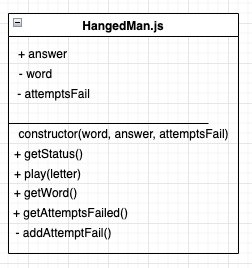

# hangedman-game

## How to install hangedman-game library

- To install hangedman-game library in your project just run the following command:

```
npm i @tive-labs/hangedman-game;

```

## How to use hangedman-game library

1. ### Parameters
- This game support two categories: 1 - animals, 2 - numbers
- This game support three levels: 1 - easy, 2 - medium, 3 - hard

2. ### Import the library

```
import {initHangedMan} from "@tive-labs/hangedman-game";

```

3. ### Create an instance of hangedman-game
-  Use the method initHangedMan(category, level) for create an instance of hangedman-game.

```
const hangedman = initHangedMan('1', '1');

```
4. ### Play
- To play use the method play(letter) an re asign the instance with the result.


```
hangedman = hangedman.play('A');

```

5. ### Verify all status value
- To verify all status value, run this method, will return this value:  { GAME_STARTED: 1, WON_GAME: 2, LOST_GAME: 3 }

```
const status = hangedman.getAllStatus();

```

6. ### Verify the status game
- To verify the status game, run this method.

```
const status = hangedman.getStatus();

```

7. ### Verify quantity of attempts fails
- To verify if the play was lost use the method isLost(), return true if you lost, you lost when you quantity of attempts fails are three or more.

```
const fails = hangedman.getAttemptsFailed();

```

## Class Diagram



# HANGEDMAN CONSOLE GAME 

## Installation

```
npm install
```

## Run

```
npm start
```

## Test

```
npm test
```

## How to play
1. Select a category option
2. Select a level option
3. Write letter until fill al underscore spaces
4. You can fail only three times.